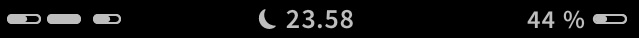

This modification alters the status bar icons. 

Icons changed are:
* Bars for signal strength (battery-like indicator)
* Wifi strength indicator (battery-like indicator)
* Activity spinner (battery-like bar bouncing back and forth)
* (Coming) Rotation Lock
* (Coming) Music/Video playing icon uses a simple play icon (as standard iOS)

